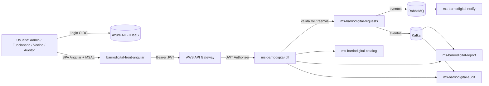

# Software Design Document (SDD) — BarrioDigital

**Asignatura:** DSY1107 — Desarrollo Cloud Native I
**Caso:** BarrioDigital — plataforma para trámites comunales y atención vecinal
**Alcance de este documento:** arquitectura general del sistema, contrato de API de cada microservicio y estructura del frontend. Sirve como guía transversal para EP1, EP2 y las evaluaciones posteriores del caso.

---

## 1. Objetivo y alcance

Diseñar la arquitectura base del sistema **BarrioDigital**, que permite a vecinos ingresar trámites, a funcionarios gestionarlos, a administradores configurar el catálogo y ver KPIs, y a auditores revisar la trazabilidad de eventos.

Este documento cubre:
- Arquitectura general (componentes y flujo de llamadas).
- Contrato de API (endpoints, request/response, códigos de error) de cada microservicio.
- Estructura del frontend Angular.

No cubre (se detalla en otros documentos del curso): topología de colas RabbitMQ/Kafka, scripts de despliegue Docker Compose, ni configuración paso a paso de Azure AD/AWS (ver README del repo).

---

## 2. Arquitectura general



**Regla de oro del flujo seguro:**
`JWT → API Gateway (valida issuer/audience) → ms-barriodigital-bff (valida rol) → microservicio de dominio`

Ningún microservicio de dominio queda expuesto directamente a internet; todo pasa por el BFF.

### 2.1 Roles del sistema

| Rol | Claim `roles` en el JWT | Descripción |
|---|---|---|
| Admin | `Admin` | Define catálogo, cupos, ve KPIs comunales |
| Funcionario (Operador) | `Funcionario` | Admite solicitudes, asigna cuadrilla, cierra trámite |
| Vecino (Cliente) | `Vecino` | Ingresa y sigue sus propios trámites |
| Auditor | `Auditor` | Solo lectura del timeline de auditoría |

### 2.2 Alcance por microservicio: EP1/EP2 vs. caso completo

| Componente | ¿Requerido en EP1/EP2? | Dependencias | Notas |
|---|---|---|---|
| `barriodigital-front-angular` | Sí | Azure AD (MSAL) | Login, guards, interceptor, vistas de trámites |
| `ms-barriodigital-bff` | Sí | Azure AD (validación JWT) | Valida issuer/audience/firma y rol |
| `ms-barriodigital-requests` | Sí | MySQL | CRUD de trámites |
| `ms-barriodigital-catalog` | No (evaluación posterior) | MySQL | Contrato incluido igual, para diseño completo |
| `ms-barriodigital-notify` | No | RabbitMQ | Consumidor, sin API pública |
| `ms-barriodigital-report` | No | Kafka | Solo lectura, agregaciones |
| `ms-barriodigital-audit` | No | Kafka | Solo lectura, timeline |

---

## 3. Convenciones generales de API

- Formato: JSON, `Content-Type: application/json`.
- Autenticación: header `Authorization: Bearer <JWT>` en todas las rutas salvo health checks.
- Errores: estructura uniforme:
```json
{
  "timestamp": "2026-09-13T10:00:00",
  "status": 404,
  "error": "Not Found",
  "message": "Tramite no encontrado: 15",
  "path": "/api/requests/15"
}
```
- Códigos usados: `200 OK`, `201 Created`, `400 Bad Request` (validación), `401 Unauthorized` (sin token / token inválido), `403 Forbidden` (rol no autorizado), `404 Not Found`.
- Fechas en formato ISO-8601 (`yyyy-MM-ddTHH:mm:ss`).

---

## 4. Contratos de API por microservicio

### 4.1 `ms-barriodigital-bff` (puerto 8080) — EN ALCANCE EP1/EP2

Actúa como intermediario entre el frontend y los microservicios de dominio. No tiene lógica de negocio propia: valida el JWT (issuer, audience, firma) y el rol, y reenvía la petición.

| Método | Ruta | Rol requerido | Reenvía a |
|---|---|---|---|
| POST | `/api/bff/requests` | Vecino, Funcionario | `POST requests:8081/api/requests` |
| GET | `/api/bff/requests/{id}` | Vecino, Funcionario, Admin, Auditor | `GET requests:8081/api/requests/{id}` |
| PUT | `/api/bff/requests/{id}/status` | Funcionario, Admin | `PUT requests:8081/api/requests/{id}/status` |
| GET | `/api/bff/requests` | Funcionario, Admin | `GET requests:8081/api/requests` |
| GET | `/api/bff/catalog/procedures` | todos autenticados | `GET catalog:8082/api/catalog/procedures` *(fuera de EP1/EP2)* |
| GET | `/api/bff/report/kpis` | Admin | `GET report:8084/api/report/kpis` *(fuera de EP1/EP2)* |
| GET | `/api/bff/audit` | Admin, Auditor | `GET audit:8085/api/audit` *(fuera de EP1/EP2)* |

**Ejemplo — crear trámite vía BFF:**

Request:
```
POST /api/bff/requests
Authorization: Bearer <jwt>
{
  "tipoTramite": "CERTIFICADO_RESIDENCIA",
  "vecinoEmail": "vecino@duocuc.cl"
}
```
Response `201 Created`:
```json
{
  "id": 1,
  "tipoTramite": "CERTIFICADO_RESIDENCIA",
  "vecinoEmail": "vecino@duocuc.cl",
  "estado": "INGRESADO",
  "fechaCreacion": "2026-09-13T10:00:00",
  "fechaActualizacion": "2026-09-13T10:00:00"
}
```

---

### 4.2 `ms-barriodigital-requests` (puerto 8081) — dominio: Trámites — EN ALCANCE EP1/EP2

| Método | Ruta | Body | Descripción |
|---|---|---|---|
| POST | `/api/requests` | `TramiteRequestDto` | Crea un trámite en estado `INGRESADO` |
| GET | `/api/requests/{id}` | — | Obtiene un trámite por id |
| PUT | `/api/requests/{id}/status` | `EstadoUpdateDto` | Cambia el estado del trámite |
| GET | `/api/requests?status=&from=&to=` | — | Lista trámites, filtro opcional por estado |

**Modelo `Tramite`:**
```json
{
  "id": 1,
  "tipoTramite": "string",
  "vecinoEmail": "string",
  "estado": "INGRESADO | ADMITIDO | EN_GESTION | EN_TERRENO | RESUELTO | RECHAZADO",
  "fechaCreacion": "datetime",
  "fechaActualizacion": "datetime"
}
```

**Regla de negocio:** no se puede pasar a `EN_TERRENO` sin antes pasar por `ADMITIDO` (validar en `TramiteService.cambiarEstado`, pendiente de implementar la restricción de transición de estados).

---

### 4.3 `ms-barriodigital-catalog` (puerto 8082) — dominio: Catálogo de trámites — FUERA DE ALCANCE EP1/EP2

| Método | Ruta | Body | Descripción |
|---|---|---|---|
| GET | `/api/catalog/procedures` | — | Lista tipos de trámite y cupos diarios |
| POST | `/api/catalog/procedures` | `ProcedureDto` | Crea un tipo de trámite |
| PUT | `/api/catalog/procedures/{id}` | `ProcedureDto` | Actualiza requisitos/cupo |

**Modelo `Procedure`:**
```json
{
  "id": 1,
  "nombre": "CERTIFICADO_RESIDENCIA",
  "requisitos": ["Cédula de identidad", "Comprobante de domicilio"],
  "cupoDiario": 20,
  "cupoDisponibleHoy": 14
}
```
**Regla de negocio:** `cupoDisponibleHoy` disminuye cada vez que `ms-barriodigital-requests` admite un trámite de ese tipo (vía evento).

---

### 4.4 `ms-barriodigital-notify` (sin exposición HTTP pública) — FUERA DE ALCANCE EP1/EP2

Consumidor de RabbitMQ (colas `q.cmd.email`, `q.cmd.crew`, `q.cmd.certificate`). No expone API REST; solo procesa mensajes y llama a proveedores externos (email/push) o genera el ticket de visita.

**Envelope de mensaje esperado:**
```json
{
  "type": "EMAIL_ADMITIDO | CREW_TICKET | CERTIFICATE_GEN",
  "eventId": "uuid",
  "timestamp": "datetime",
  "traceId": "uuid",
  "correlationId": "uuid",
  "payload": { "tramiteId": 1, "vecinoEmail": "vecino@duocuc.cl" }
}
```

---

### 4.5 `ms-barriodigital-report` (puerto 8084) — FUERA DE ALCANCE EP1/EP2

Consumidor de Kafka (`requests.events`), expone solo lectura.

| Método | Ruta | Descripción |
|---|---|---|
| GET | `/api/report/kpis?range=last24h` | Trámites por hora, tiempo de resolución promedio, estados activos |
| GET | `/api/report/top-procedures?range=last7d` | Tipos de trámite más solicitados |

---

### 4.6 `ms-barriodigital-audit` (puerto 8085) — FUERA DE ALCANCE EP1/EP2

Consumidor de Kafka (`audit.timeline`), expone solo lectura.

| Método | Ruta | Descripción |
|---|---|---|
| GET | `/api/audit?tramiteId=&usuario=&from=&to=&tipoEvento=` | Timeline de eventos filtrable |

**Modelo `AuditEvent`:**
```json
{
  "eventId": "uuid",
  "tramiteId": 1,
  "usuario": "funcionario@duocuc.cl",
  "accion": "INGRESO | ADMISION | VISITA | RESOLUCION",
  "timestamp": "datetime"
}
```

---

## 5. Frontend — estructura Angular (sin Clean Architecture)

Para EP1/EP2 se usa una estructura simple por capas técnicas — no por capas de dominio — priorizando velocidad de entrega. Es "modular" (cumple el aspecto formal de la rúbrica) sin el overhead de interfaces/mappers de Clean Architecture.

### 5.1 Estructura de carpetas

```
src/app/
├── core/
│   ├── auth/
│   │   ├── msal.config.ts          (configuración de MsalModule/MsalService)
│   │   └── auth.service.ts         (helpers: getRoles(), login(), logout())
│   ├── guards/
│   │   └── role.guard.ts           (protege rutas por rol)
│   └── interceptors/
│       └── auth.interceptor.ts     (adjunta el Bearer token a cada request)
│
├── services/
│   └── tramites.service.ts         (llamadas HTTP directas al BFF)
│
├── models/
│   └── tramite.model.ts            (interfaces TypeScript de los DTOs)
│
├── pages/
│   ├── login/
│   │   └── login.component.ts
│   ├── dashboard/
│   │   └── dashboard.component.ts  (vista distinta segun rol)
│   └── requests/
│       ├── requests-list.component.ts
│       └── requests-create.component.ts
│
├── app.routes.ts                   (rutas + guards)
└── app.config.ts                   (providers: MSAL, HttpClient con interceptor)
```

### 5.2 Modelo de datos (`models/tramite.model.ts`)

```typescript
export type EstadoTramite =
  | 'INGRESADO' | 'ADMITIDO' | 'EN_GESTION'
  | 'EN_TERRENO' | 'RESUELTO' | 'RECHAZADO';

export interface Tramite {
  id: number;
  tipoTramite: string;
  vecinoEmail: string;
  estado: EstadoTramite;
  fechaCreacion: string;
  fechaActualizacion: string;
}
```

### 5.3 Servicio HTTP (`services/tramites.service.ts`)

```typescript
import { Injectable } from '@angular/core';
import { HttpClient } from '@angular/common/http';
import { Observable } from 'rxjs';
import { Tramite, EstadoTramite } from '../models/tramite.model';
import { environment } from '../../environments/environment';

@Injectable({ providedIn: 'root' })
export class TramitesService {
  private readonly baseUrl = `${environment.bffUrl}/api/bff/requests`;

  constructor(private readonly http: HttpClient) {}

  crear(tipoTramite: string, vecinoEmail: string): Observable<Tramite> {
    return this.http.post<Tramite>(this.baseUrl, { tipoTramite, vecinoEmail });
  }

  listar(estado?: EstadoTramite): Observable<Tramite[]> {
    const params = estado ? { status: estado } : {};
    return this.http.get<Tramite[]>(this.baseUrl, { params });
  }

  cambiarEstado(id: number, estado: EstadoTramite): Observable<Tramite> {
    return this.http.put<Tramite>(`${this.baseUrl}/${id}/status`, { status: estado });
  }
}
```

Los componentes de `pages/requests/` inyectan `TramitesService` directo — sin capa de "caso de uso" intermedia. Es menos desacoplado que Clean Architecture, pero para 3 pantallas es la opción correcta dado el tiempo disponible.

### 5.4 Configuración MSAL (`core/auth/msal.config.ts`)

```typescript
import { PublicClientApplication, LogLevel } from '@azure/msal-browser';

export const msalInstance = new PublicClientApplication({
  auth: {
    clientId: '<API_CLIENT_ID>',           // Application (client) ID del App Registration
    authority: 'https://login.microsoftonline.com/<TENANT_ID>',
    redirectUri: 'http://localhost:4200',
  },
  cache: {
    cacheLocation: 'localStorage',
  },
  system: {
    loggerOptions: {
      logLevel: LogLevel.Warning,
    },
  },
});

export const protectedResources = {
  bff: {
    endpoint: 'http://localhost:8080',
    scopes: ['api://<API_CLIENT_ID>/access_as_user'],
  },
};
```

### 5.5 Guard por rol (`core/guards/role.guard.ts`)

```typescript
import { inject } from '@angular/core';
import { CanActivateFn, Router } from '@angular/router';
import { MsalService } from '@azure/msal-angular';

export function roleGuard(allowedRoles: string[]): CanActivateFn {
  return () => {
    const msalService = inject(MsalService);
    const router = inject(Router);

    const account = msalService.instance.getActiveAccount();
    const roles = (account?.idTokenClaims as any)?.roles ?? [];

    const autorizado = roles.some((r: string) => allowedRoles.includes(r));
    if (!autorizado) {
      router.navigate(['/dashboard']);
      return false;
    }
    return true;
  };
}
```

### 5.6 Rutas (`app.routes.ts`)

```typescript
import { Routes } from '@angular/router';
import { MsalGuard } from '@azure/msal-angular';
import { roleGuard } from './core/guards/role.guard';
import { LoginComponent } from './pages/login/login.component';
import { DashboardComponent } from './pages/dashboard/dashboard.component';
import { RequestsListComponent } from './pages/requests/requests-list.component';
import { RequestsCreateComponent } from './pages/requests/requests-create.component';

export const routes: Routes = [
  { path: 'login', component: LoginComponent },
  { path: 'dashboard', component: DashboardComponent, canActivate: [MsalGuard] },
  {
    path: 'requests',
    component: RequestsListComponent,
    canActivate: [MsalGuard, roleGuard(['Admin', 'Funcionario'])],
  },
  {
    path: 'requests/nuevo',
    component: RequestsCreateComponent,
    canActivate: [MsalGuard, roleGuard(['Vecino', 'Funcionario'])],
  },
  { path: '', redirectTo: 'dashboard', pathMatch: 'full' },
];
```

### 5.7 Dependencias npm requeridas

```bash
npm install @azure/msal-angular @azure/msal-browser
```

---

## 6. Anexo — checklist de coherencia entre documentos

- [ ] Nombres de rutas de este SDD coinciden con los controllers reales (`TramiteController`, `BffRequestsController`)
- [ ] Roles del JWT (`roles` claim) coinciden con los App Roles creados en Azure AD
- [ ] Puertos declarados aquí coinciden con `application.properties` de cada microservicio
- [ ] Modelo `Tramite` de este documento coincide con la entidad JPA `Tramite.java` y con `tramite.model.ts`
